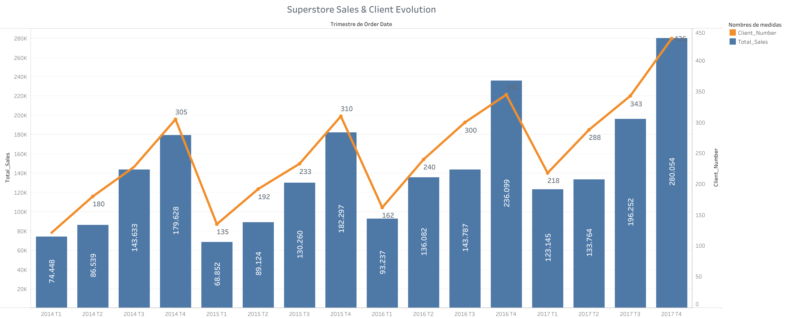
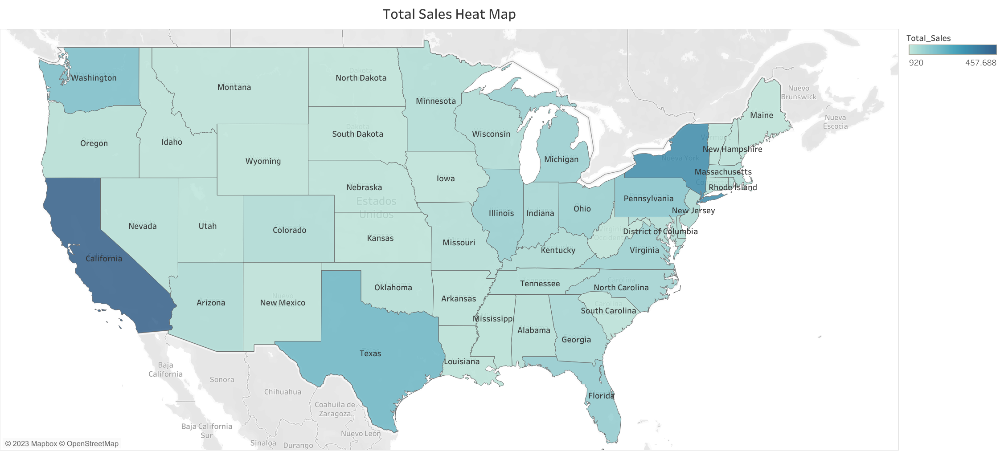
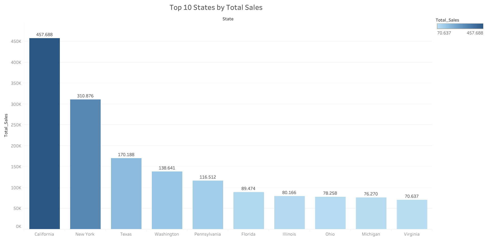
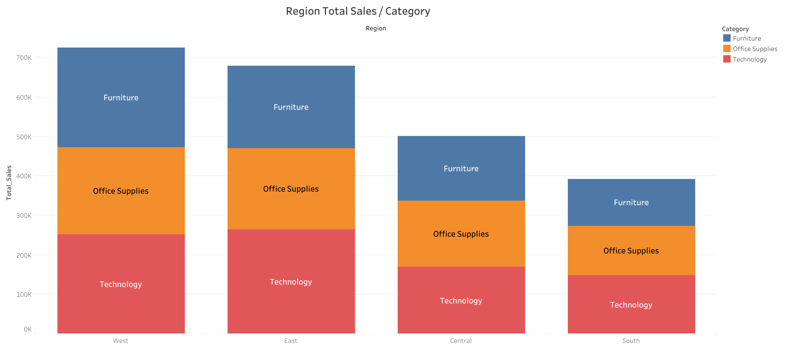
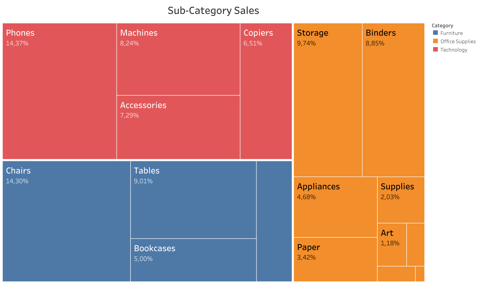
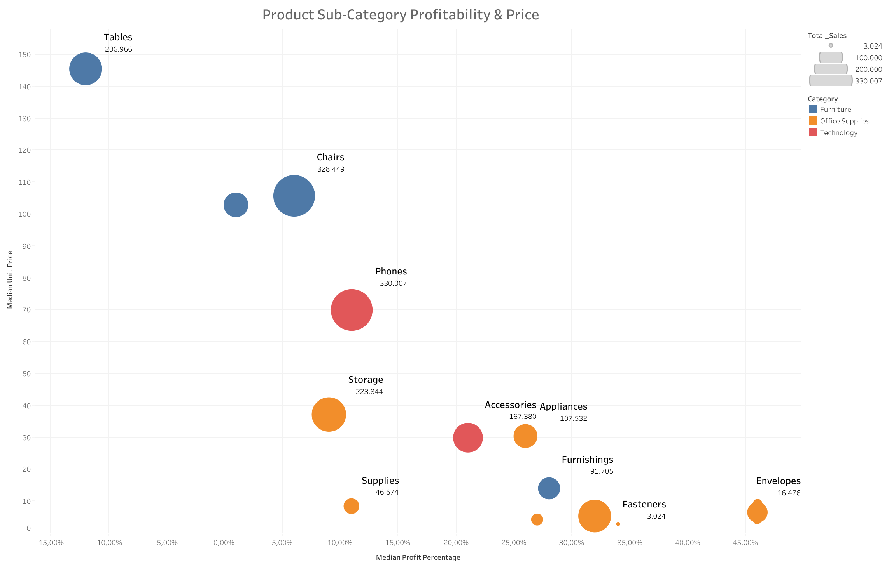
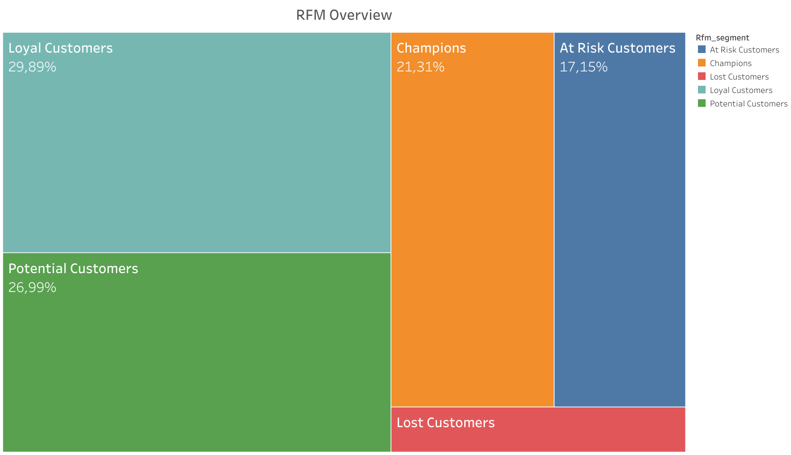
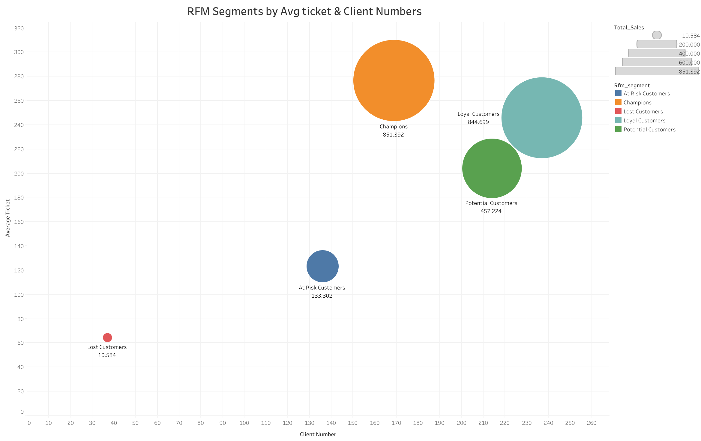

# **Project 4 --> Superstore Sales Visualization**

## **1. Summary**

For this project, I had to analyze the sales data of a superstore from a Kaggle dataframe using Python, SQL, and Tableau. I performed various modifications to the dataframe in Python to prepare it for analysis. Then, I stored the final table and created another one with an RFM analysis from the clients of the main transactional dataframe using SQL. Finally, I used Tableau to perform an exploratory analysis of the data. By using a combination of these tools, I was able to gain insights into the superstore's sales and customer behavior.

Since all the visualizations and insights have been performed in Tableu, we will jump straight to this part:

## **2. Sales Overview**

### **2.1 Superstore Sales and Client Evolution**

In this graph we can see that the sales are growing with the number of clients. Also, we can appriciate that sales are seasonal. Soon we will understand why. 

 

### **2.2 Sales Map**

As shown on the image below, all the superstore locations are based on the USA. As more dark is the blue color, more sales are in that specific State. 

### **2.3 Top 10 States by total Sales**

In the following bar graph we can see that California is the top State, followed by New York and Texas. 

### **2.4 Sales & Discounts Correlation**

The seasonlity seen in the first graph looked strange, so I created the following graph with the goal of understand if it had any correlation with the discounts. 

As we can see, there exists a huge correlation between sales and discounts. So we can assume that the discounts have a big inpact on the business model.## Profitability 

### **2.5 Region x Product Category Sales**

States are also grouped by region. This information enable us to explore this aggregated info with, for example, the sales per product category.

### **2.6 Sub-Category Overview**

Each product category has several subcategories associated with it. In the following treemap, you will be albe to see the weight of this subcats based on the total sales

## **3. Profitability**

Every company goal is to make money, so in order to do that has to make profit in each product they are selling to the customers. Let's take a look on it. 

### **3.1 Region - Client Segment Profitability**

As seen in the image below, there is not much difference of profitability between segments and regions. The only one that is significantly lower than the other is the customer clients for the central region;

### **3.2 SubCategory Profitability & Median Unit Price** 

This scatter chart has enabled us to understand the relation of the unit price with its profitability. Looks like there is an inverse correlation between unit price and profitability.

### **3.3 State Profitability Analysis**

In the scatter plot below, we can differentiate two groups of states separated by profitability. 

## **4. RFM Analysis**

As I mentioned in the initial summary, I used transactional data to segment customers based on recency, frequency and average purchase value.

Here, we can see the segments based on the client number and average ticket;

## **5. Take Aways**

Based on the analysis of the superstore data using Tableau, it is clear that there are some furniture subcategories that are non-profitable. This suggests that the company should consider either cutting down on these subcategories or finding ways to make them more profitable.

In addition, the analysis has revealed a clear split in two groups of states, with some states being profitable while others are not. It is important for the company to identify the reasons behind this split and take steps to address any issues in the non-profitable states.

Another key finding from the analysis is that the company has a heavy reliance on discounts and promotions in order to increase sales. This suggests that the company may need to consider alternative strategies for increasing sales, such as improving product quality or offering unique services to customers.

Overall, the analysis highlights several areas where the company can improve its profitability and performance. By focusing on these areas and making changes as needed, the company can work towards increasing its profitability and achieving long-term success in the marketplace.

